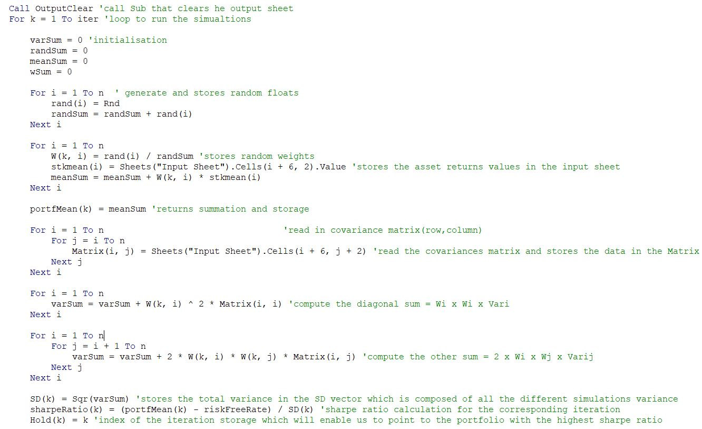
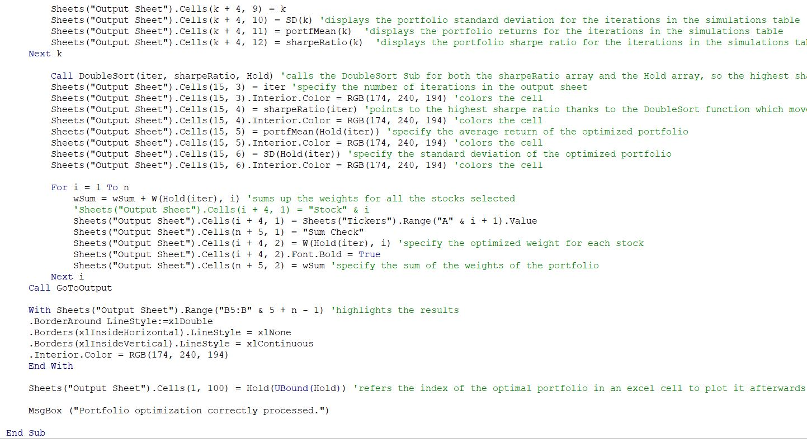
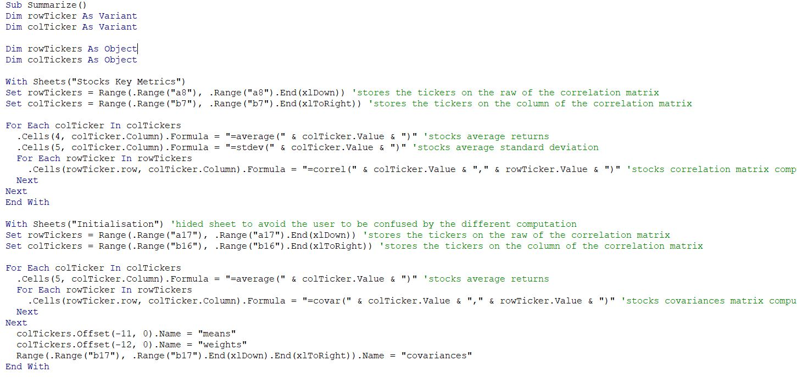
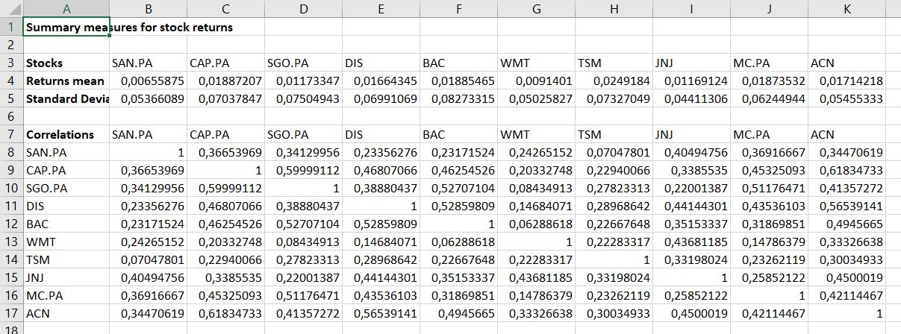

# VBA Project - Stocks Portfolio Optimization

Team : Ilyès BOUSSOUF; Jardiel Junior DA SILVA ARAUJO; Ikram OUDRA; Ilyasse BENOUNI; Ilyas MASMOUDI

## Objectives

The main objective of this project is to construct an Automated Portfolio Optimization Program in which the user can:
  1. Choose the number of stocks in the portfolio he wants to build.
  2. Import automatically the historical data for each stock with a given ticker (from Yahoo Finance, accessed using alphavantage) to update the data in real-time.
  3. Compute automatically different metrics related to stock performance (returns, volatility, Sharpe Ratio…) and construct the efficient frontier.
  4. The code will optimize the portfolio weights to maximize the Sharpe ratio, optimizing the trade-off between returns and volatility.
  5. Finally, the user can select the “optimal” portfolio and its relative weights.

## Model test

## Test 1

### Inputs

Risk-free Rate : 0.3% \
Number of iterations : 5000

Start Date : 17/01/2000\
End Date : 17/10/2020

Stocks tickers selected :
* AI.PA (Air Liquide)
* AAPL (Apple)
* MSFT (Microsoft)
* NVDA (Nvidia)
* AMZN (Amazon)
* V (Visa)
* MA (Mastercard)
* WMT (Walmart)

Number of Stocks : 8

### Outputs

#### Optimal weights

* AI.PA weight : 3.78%
* AAPL weight : 19.75%
* MSFT weight : 3.18%
* NVDA weight : 8.62%
* AMZN weight : 16.69%
* V weight : 20.06%
* MA weight : 12.67%
* WMT weight : 15.25%

Sump Check = 100%

#### Optimal portfolio Performance

* Sharpe Ratio : 0.43190822
* Portfolio Average Returns : 2.335%
* Portfolio Standard Deviation : 4.712%

#### Optimization simulations, Optimal Portfolio & Capital Market Line

## Test 2

### Inputs

Risk-free Rate : 0.005 (=0.5%) \
Number of iterations : 10000

Start Date : 10/03/2002\
End Date : 17/05/2021

Stocks tickers selected :
* SAN.PA (Sanofi)
* CAP.PA (Capgemini)
* SGO.PA (Société Générale)
* DIS (The Walt Disney Company)
* BAC (Bank of America Corp)
* WMT (Walmart)
* TSM (Taiwan Semiconductor Manufacturing Company)
* JNJ (Johnson & Johnson)
* MC.PA (LVMH Moët Hennessy)
* ACN (Accenture)

Number of Stocks : 10

### Outputs

#### Optimal weights

* SAN.PA weight : 0.89%
* CAP.PA weight : 6.03%
* SGO.PA weight : 0.16%
* DIS weight : 0.95%
* BAC weight : 13.37%
* WMT weight : 11.71%
* TSM weight : 23.79%
* JNJ weight : 5.32%
* MC.PA weight : 26.07%
* ACN weight : 11.71%

Sump Check = 100%

#### Optimal portfolio Performance

* Sharpe Ratio : 0.3181
* Portfolio Average Returns : 1.841%
* Portfolio Standard Deviation : 4.214%

#### Optimization simulations, Optimal Portfolio & Capital Market Line

## Code explanations

We segmented our VBA codes in 3 modules. Module 1 aims to perform the different computations for the portfolio optimization. Module 2 aims to extract the calculations from Module 1, distribute them into the different Excel sheet to make them clear and intuitive. Plus, Module 2 extract the data from Yahoo Finance through Alphavantage, distribute them into the sheets to be then processed by Module 1. Finally, Module 4 aims to manage the different results within the different Excel sheets, generate charts...

### Module 1

#### Step 1 : Portolio optimization process initialization

Sub PortfOptProcess() aims to compute the potfolio optimization process. The first part of this Sub (see screenshot above) is initializing the different main parameters that are going to be used during the optimization process usch as the risk-free rate, the number of iterations, the number of stocks, initializing matrices that are going to be filled by optimization parameters such as portofolio returns, standard deviation, sharpe ratio etc.

#### Step 2 : Portolio optimization process

This is the following of Sub PortfOptProcess(), the different comments aim to help the user in understanding the different computations performed.
In this part, the core of the portfolio optimization process is realized. We run numerous simulations based on the stocks selected by the user and the number of iterations order by him to select the "best" portfolio which corresponds to the tangency portfolio in practise which presents the highest Sharpe Ratio. In order to do this, we run a Loop which is going to compute the sharpe ratio of X portfolios (X corresponding to the number of iterations) and is going to select the one with the highest Sharpe Ratio. To select the "best" portfolio, this Sub uses another Sub in parallel called DoubleSort() and GoToOutput() which are going to be detailed in the following.

Sub DoubleSort() aims to help PortfOptProcess() to select the "best" portfolio within all our different simulations generated by PortfOptProcess(). In order to do this, DoubleSort() is using loops strategy is pushing in the highest index of a matrix the portfolio with the highest sharpe ratio along the iterations. Thanks to this Sub, our "best" portfolio will be always localized in the last index of an input matrix, which makes its localization easier in the end (we just have to take the last component of the input matrix to find the best portfolio). In other terms, this Sub is sorting an input array Y based on an input array X.

This section of Module 1 simply clears the output area to update the result for each portfolio optimization. That way, the user doesn't have to do it by himself. The code is self-sufficient and everything could be done unqiuely using buttons. Moreover, the last Sub GoToOutput() can be used to redirect the user to the output sheet.

### Module 2

#### Step 1 : Display a Tickers input customzied window

Sub showTickerFrom() aims to display the customized Tickers window designed on VBA.
Sub getTickerData() aims to extract the stocks data from https://www.alphavantage.co/ using its API.

#### Step 2 : Extract the stocks data

This Sub aims to call the data extraction using one of our other Sub (getHistoricalData) from financial markets and aims to prepare our different sheets for the data processing.

Sub getHistoricalData aims to extract the data from financial markets to be further processed. 

#### Step 3 : Summarize key data from our stocks data processing

Sub Summarize() aims to summarize all the stocks key metrics in the Excel sheet "Stocks Key Metrics" with stocks correlations, stocks average returns, stocks mean standard deviartion for the user to get a clear overview of the different contributions from each stocks, their respective performances and the role they are likely to have in our portfolio (if stocks are negatively correlated to others etc..)

Here is an overview of the stocks key metrics present in the "Stocks Key Metrics" for the Test 2 presented in our Model Test :

#### Step 3 : Summarize key data from our stocks data processing

## Model Limitations  

Regarging our model several points can be pointed

### Module 4
Sub TransferCov()

This sub has as goal to transfer the covariance matrix calculated during the optimization portfolio proccess. 

Sub Chart1() 

This sub is responsible for create the charts that are plotted in this project. In order to do it, all the parameters (chart type, data series...) need to be inputed during the chart construction proccess.

Sub backtestvalues()

In this part of the code, the optimal portfolio returns were calculated. The aim of this is to have to the user an idea of how his portfolio would have performed in a period if he was allocating his resources in this portfolio.

